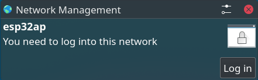
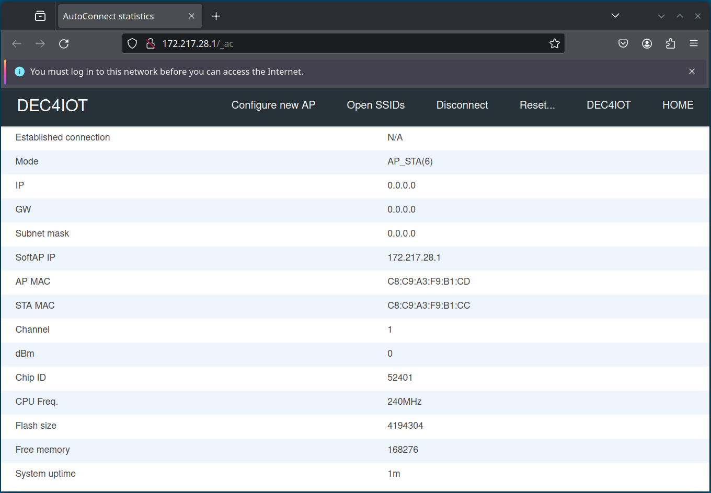
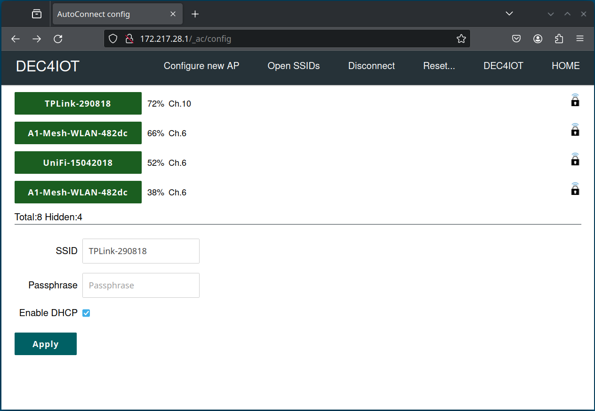
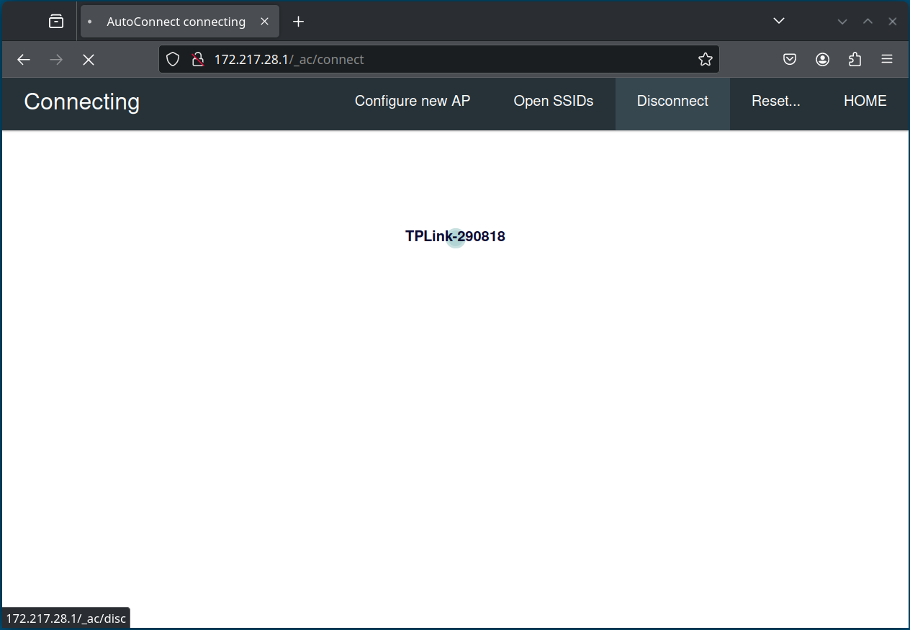
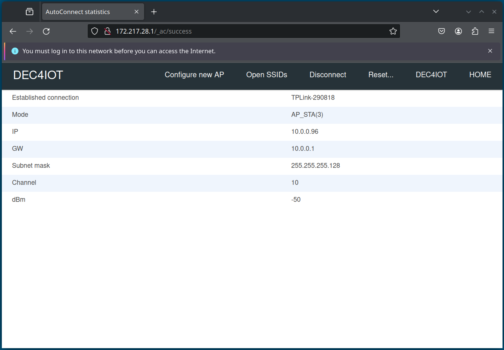
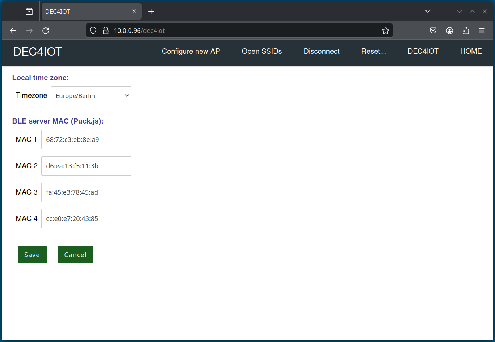
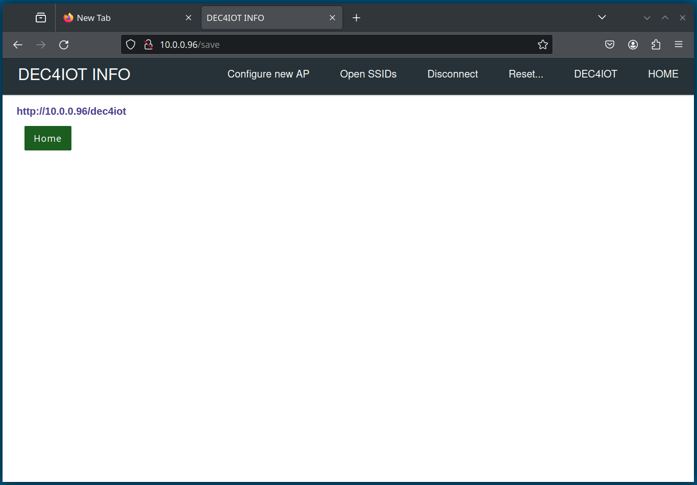

This repository provides a comprehensive solution for monitoring IoT devices, with this part describing the ESP32 BLE/WiFi Gateway. With this software, users can integrate sensors (Puck.js) and monitor the status, performance, and any anomalies. The system continuously collects data from the connected devices and analyzes it to determine if they are functioning correctly or if potential problems might arise. Upon detecting unusual activities or when device parameters fall outside the established normal range, alarms are immediately triggered. These alerts can be relayed through various channels such as email, or alerting through the DEC112 ESInet. The repository includes both the code for data collection and analysis, as well as a user-friendly interface for configuring monitoring settings and alarm conditions. This project aims to provide a robust and scalable solution to ensure the efficiency and security of IoT networks. The current repository includes the ESP32 BLE/WiFi Gateway as shown in the figure below.


<br>

Content:
* [Further Resources](#further-resources)
* [Developer Information](#developer-information)
    * [ESP32-HW](#esp32-hw)
    * [IDE](#ide)
* [User Information](#user-information)
    * [Captive Portal](#captive-portal)
    * [MAC Address Filter](#mac-address-filter)
* [Issues](#issues)
* [About](#about)
* [License](#license)

## Further Resources
* Project description: https://www.netidee.at/dec4iot    
* Semantic Container: https://github.com/OwnYourData/semcon    
* Blogpost on Monitoring (in German): https://www.netidee.at/dec4iot/system-monitoring-fuer-dec4iot

## Developer Information

### ESP32-HW

We recommend the following hardware for this project: [ESP32 NodeMCU](https://www.berrybase.at/esp32-nodemcu-development-board?c=2473)

### IDE

The ESP32 BLE/WiFi Gateway was created with [PlatformIO IDE](https://platformio.org/) and VS Code (alternatively, [Arduino IDE](https://www.arduino.cc/en/software) can also be used). Besides the platform 'espressif32', the board 'nodemcu-32s' and the 'arduino' framework, no further libraries are necessary. The following additions are required:

- to support MAC in Notfiy callback, the following changes are required in

_BLERemoteCharacteristic.h_
`````
~/.platformio/packages/framework-arduinoespressif32/libraries/BLE/src/BLERemoteCharacteristic.h
`````

line 25: add <em>esp_bd_addr_t addr,</em>

`````
typedef std::function<void(BLERemoteCharacteristic* pBLERemoteCharacteristic, esp_bd_addr_t addr, uint8_t* pData, size_t length, bool isNotify)> notify_callback;
`````

_BLERemoteCharacteristic.cpp_

`````
~/..platformio/packages/framework-arduinoespressif32/libraries/BLE/src/BLERemoteCharacteristic.cpp
`````

line 166: add <em>evtParam->notify.remote_bda,</em>

`````
m_notifyCallback(this, evtParam->notify.remote_bda, evtParam->notify.value, evtParam->notify.value_len, evtParam->notify.is_notify);
`````

- Callback example

just add <em>BLEAddress BLEAddr,</em> as shown below

`````
static void notifyButtonCallback(BLERemoteCharacteristic* pBLERemoteCharacteristic, BLEAddress BLEAddr, uint8_t* pData, size_t length, bool isNotify)
...
  Serial.printf(" ADDR[%s] ", BLEAddr.toString().c_str());
...
`````
- platformio.ini

`````
[env:esp32dev]
platform = espressif32
board = nodemcu-32s
framework = arduino
monitor_speed = 115200
upload_port = /dev/ttyUSB*
board_build.partitions = no_ota.csv
lib_deps = hieromon/AutoConnect@^1.4.2
`````

### ESP32-SW

Two files in the project are sufficient to enable all functions of the ESP32 BLE/Wifi GW:
- **json.h**: is an integrated library to provides essential JSON functionality for the project. The library was supplemented by the _jsonb_float()_ function.
- **main.cpp**: includes ESP32 setup and loop functions as well as callback and help functions for operating the GW

Since a connection can be initiated with any BLE device, we filter our devices (Puck.js) based on their MAC addresses (According to the standard, a maximum of 4 devices can be connected). The current version saves configured puck.js MAC addresses permanently in the ESP32 EEPROM, i.e. reconfiguration after a restart of the ESP32 is not necessary. The last selected WiFi also remains saved. Further details on configuring the ESP32 via a captive portal can be found under _User information_ below.

## User Information

### Captive Portal

The first step is to select the ESP32 WiFi (ssid: esp32ap; password: 12345678) on the laptop or mobile device. Depending on the operating system, you will be prompted to log in to the portal (login page), see the figures below:


<br>



<br>

After successful login the following page appears:



<br>

Use the _Configure new AP_ menu to select a local WiFi from the list (to specify a static IP address, clear the _Enable DHCP_ checkbox.) and log in with the local password, as shown below:



<br>

The following page is shown during the configuration:



<br>

If the new WiFi has been successfully configured, the following information page is displayed. The line with the IP address is important - copy this address and create the following URL: _http://\<ip-addr\>/dec4iot_; in the example shown, this is _http://10.0.0.96/dec4iot_



<br>

### MAC Address Filter

Now you can switch to the local network (_Established Connection_) to configure the local time zone and the MAC addresses (puck.js)



<br>

After clicking the Save button, the following page will appear after successful saving. From now on, the system searches for configured puck.js and establishes a BLE connection if necessary (i.e. if the MAC address matches).



<br>

## Issues

Please report bugs and suggestions for new features using the [GitHub Issue-Tracker](https://github.com/dec112/dc-iot/issues) and follow the [Contributor Guidelines](https://github.com/twbs/ratchet/blob/master/CONTRIBUTING.md).

If you want to contribute, please follow these steps:

1. Fork it!
2. Create a feature branch: `git checkout -b my-new-feature`
3. Commit changes: `git commit -am 'Add some feature'`
4. Push into branch: `git push origin my-new-feature`
5. Send a Pull Request

&nbsp;    

## About  

This project has received funding from [Netidee Call 17](https://netidee.at).

<br clear="both" />

## License

[MIT License 2023 - DEC112](https://raw.githubusercontent.com/dec112/dc-iot/main/LICENSE)

