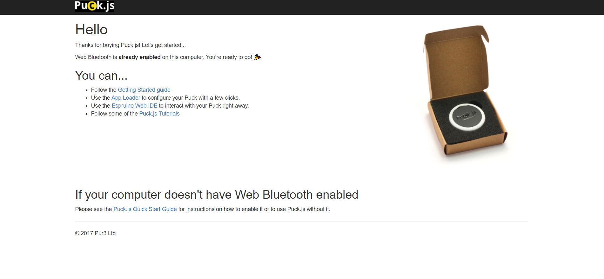
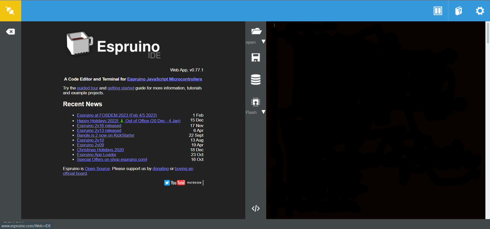
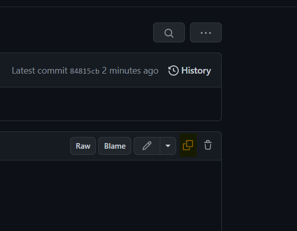
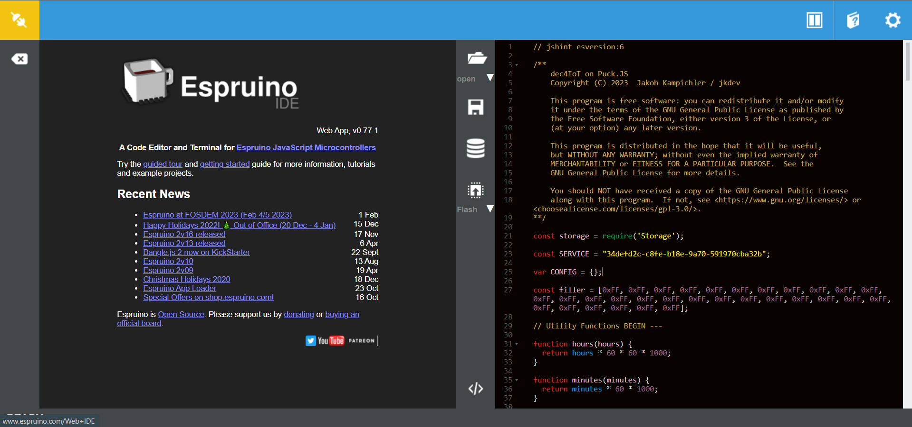
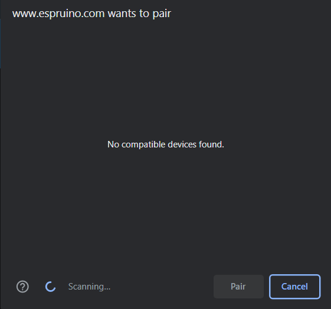

# How to use a Puck.JS

# 1. Getting Started

Visit [this](https://www.puck-js.com/go) Website. It should look somewhat like this:

It will tell you if Web Bluetooth is enabled on your device. To continue, you must:

- If “Web Bluetooth is already enabled …”, you can continue by pressing the Espruino Web IDE link
- If “Web Bluetooth is not enabled …”, continue with the Puck.js Quick Start Guide.

If you have enabled Web Bluetooth, check the page above again. Continue with pressing the Espruino Web IDE link!

# 2. Flashing the firmware.

1. The opened page will look something like this:

    

    The right side may already have some code in it. If it has, delete it.

2. Now visit [this](https://github.com/dec112/sensors_iot/blob/main/puck-js/puck_js-latest.js) page. Copy all the code by pressing that button:
Paste it into the Web IDE.

    

3. Your screen should now look somewhat like this:
    
    
    
    Press the arrow next to the “RAM” text. There, choose “Flash”. This will make the uploaded code persist after reboots.
    
4. Press the yellow button on the upper left edge of the screen. In the menu, choose “Web Bluetooth”

5. Wait until your device appears in the browser dialogue, then choose it and press pair!
The in the top left corner should now be green.

    

6. Press the “Flash” button, then wait until the bottom right corner says “SENT”!
7. Disconnect by pressing the green icon in the top left corner

# 3. Using the Onboarding App

1. Install it using the APK
2. Check if the MLkit modules are available: 
Press the ellipsis menu in the top right corner → Press “Check for Modules”
If all modules are available, continue!
3. Grant the necessary permissions:
Press the ellipsis menu in the top right corner → Press “Check for Permissions”
Grant all permissions! Use the option “While the app is open”.
(If asked, give “Percise” Location permission. This is required for Bluetooth to work.)
4. Press “Start”
5. Scan the QR code from the dec4IoT dashboard!
6. Choose your device
7. Choose your device in the device picker. It will start rotating colours. After, press “Continue”
8. Check, whether you entered all the information correctly.
9. Tick the checkbox.
10. Press continue.
If a message pops up, wait some time, the device hasn’t yet connected properly!
11. You’re done!

# 4. How to un-onboard a device

1. Restart your device
2. Follow steps 1. to 5. from section 2.
You need to do this quickly. You will only have 15 seconds before the device boots back into the “dec4IoT” firmware.
3. Press the icon above the “Flash” Button.
4. Click the “Bin” icon next to “main.json”
5. Disconnect from the device by pressing the green icon in the top left corner.
6. Restart your device

Now you can onboard the device again using the app or flash another firmware to it using the Espruino IDE

# 5. Other information

- If you want to see what characteristics your device currently publishes, download “NRF connect” from the Google Play Store. In the app, it will show up as “Dec4IoT Device”. If you have multiple devices, check the MAC-address. The dec4IoT service has a UUID that begins with “34defd2c”. In that service you will see 5 characteristics:
    - one that begins with “34defd2c” (This contains information set during Onboarding)
    - one that says “Temperature”
    - one that says “Battery Level” (often inaccurate, Puck.Js’ battery sensor is a bit ******stupid******)
    - one that says “Unknown Characteristic”, UUID: 0x2AE2 (this is the button press)
    - one that says “Unknown Characteristic”, UUID: 0x2C01 (this is “was sudden movement detected?”)
